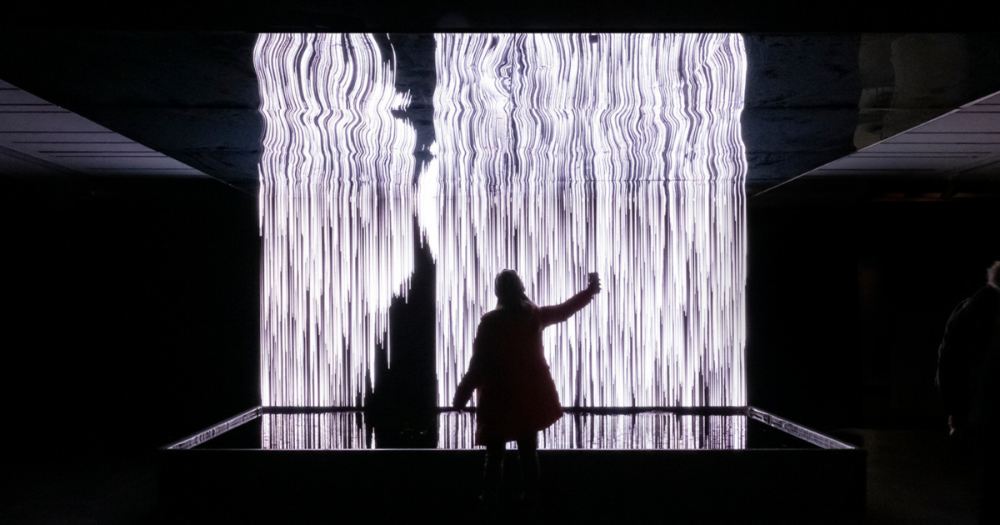
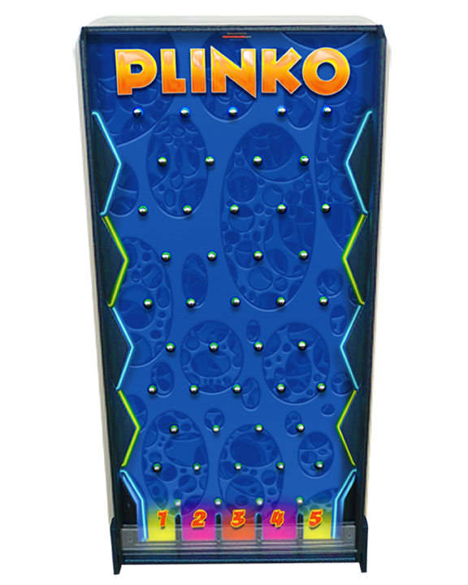
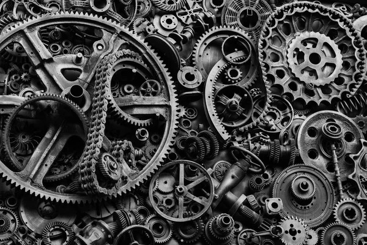

# Ichr0079_9103_Tut1_Major-Project

## Instructions on interactivity

Upon loading the page, small beads will start to fall down like a waterfall and the wheels are going to gradually spin while changing colors and patterns. There are also going to be beads that bounce around simulating water particles. The wheels are randomly placed and the entire code is responsive, feel free to play around with different window sizes to see different streams!

### Why did i choose time?

Pacita abad's wheel of fortune consists of elements found in the real world such as shells, beads, and buttons, I was inspired by this and wanted to simulate the real world by creating an interactive piece that seems alive and ever changing, Using time allows the piece to flow without interruption which creates a soothing effect.

### Which properties will be animated and How

The piece consists of 2 main parts, the wheels themselves and the beads. the pattern based wheels are going to turn either clockwise or counter-clockwise and it is also going to alternate patterns and colors every 3 seconds. 

The beads interact with the wheel by falling down and weaving around the wheel as it falls, creating a never-ending stream of beads.

There is also a seperate class of beads that completes the piece by bouncing around, creating the illusion of particles bouncing off the wheels.

### My inspiration for the piece
I was inspired by this art exhibition in Montreal where people could interact with a digital waterfall that bends according to their silhouette.

I was also inspired by plinko machines at the arcade, it is a fun visual effect that adds excitement to the piece

Finally I thought that the wheels oof fortune drew a ressemblance to cogwheels and how they interact with each other.

## Technical Overview

The changes i made to the code are commented on each line but the main changes are :
1. Switched the color mode to HSB, to give more control over the colors
2. added rotation to the wheel by adding rotate to the circlePattern class
3. inverted the circle pattern (line becomes dots, dots becomes line) every 3 seconds.
4. Added hue shift to the circle pattern by setting an inital hue and changing it based on the framecount.
5. added velocity into the bead class so it falls down and used the dist function to make the beads interact with the wheels instead of falling through.
6. made a seperate class called tinyBead where the beads just bounce around the page in the background creating a splashing effect.